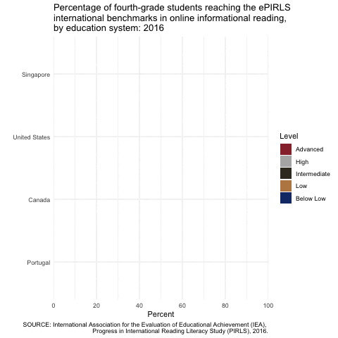
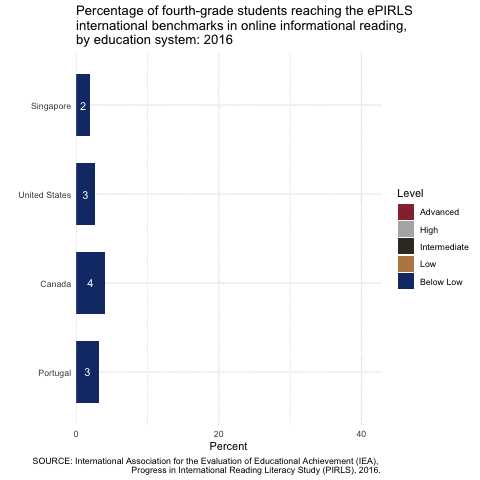
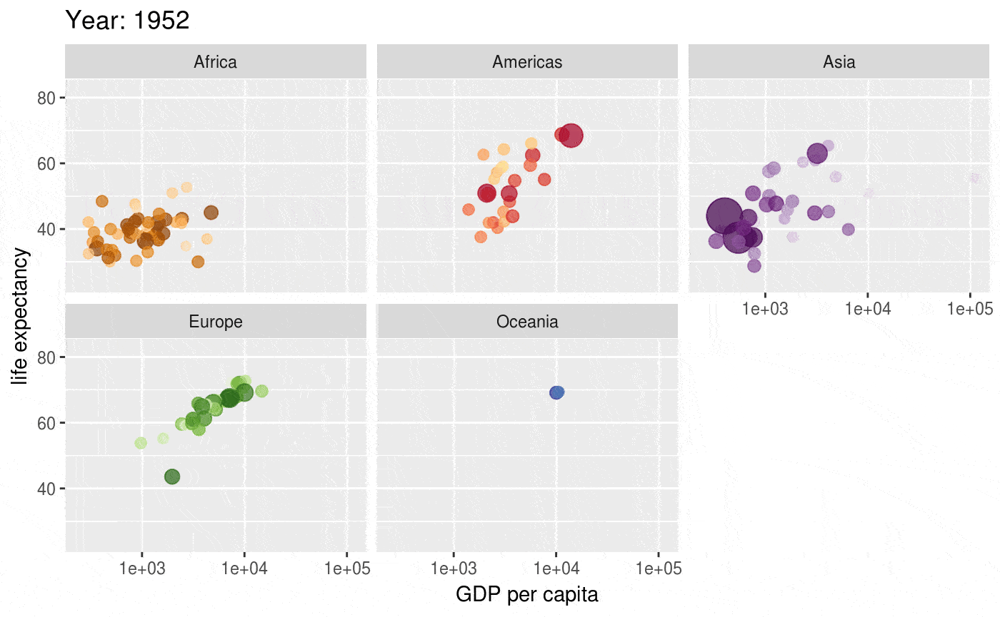
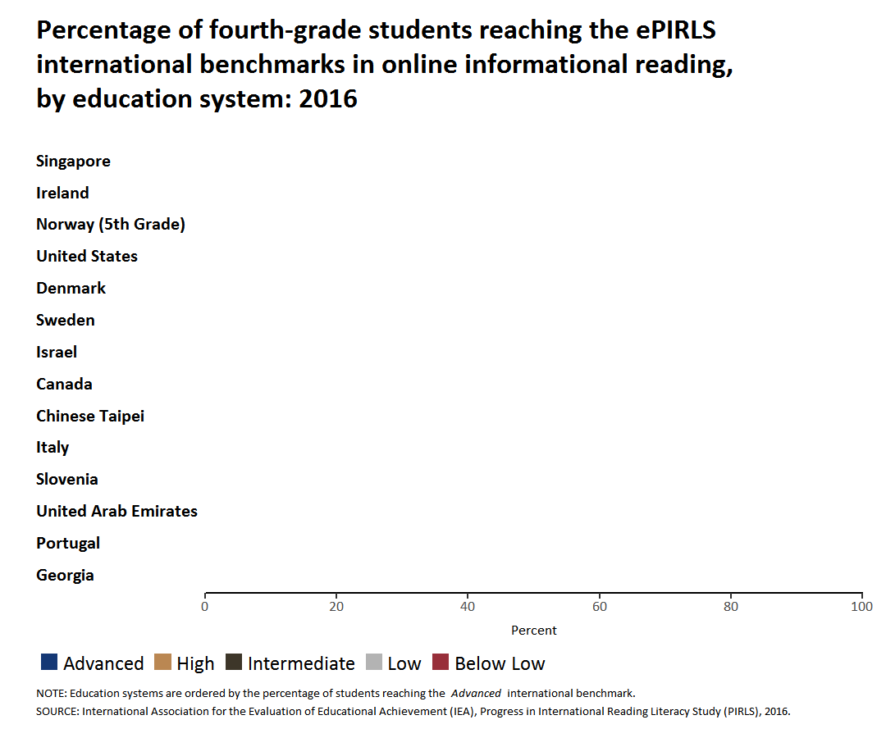

class: inverse, title-slide

<hr>

Sample Lesson
========================================================

## Creating animated visualizations in R

<br>

Yuqi Liao

yuqi.liao@georgetown.edu

_October 2020_

.logo[
```{r logo, echo=FALSE, out.width='80%', out.height='80%'}
knitr::include_graphics('presentationFigures/RStudio-Logo-White.png')
```
]

---

Outline
========================================================
- How to create animated visualizations?
  - Overall steps

---

Outline
========================================================
- How to create animated visualizations?
  - Overall steps
  - Easier approach (`gganimate`)


.pull-left[
```{r ex1, echo=FALSE, out.width=350, out.height=250}

```
]

---

Outline
========================================================
- How to create animated visualizations?
  - Overall steps
  - Easier approach (`gganimate`)
  - Customized approach (`tweenr` + `animation`, next lesson)
  
.pull-left[
```{r ex1-1, echo=FALSE, out.width=350, out.height=250}

```
]
.pull-right[
```{r ex2-1, echo=FALSE, out.width=350, out.height=250}
knitr::include_graphics('presentationFigures/epirls_tweenr_c.gif')
```
]

---

Outline
========================================================
- How to create animated visualizations?
  - Overall steps
  - Easier approach (`gganimate`)
  - Customized approach (`tweenr` + `animation`, next lesson)
- When to create animated visualizations? (next lesson)

.pull-left[
```{r ex3-1, echo=FALSE, out.width=350, out.height=250}

```
]
.pull-right[
```{r ex4-1, echo=FALSE, out.width=350, out.height=250}
knitr::include_graphics('presentationFigures/epirls_tweenr_c.gif')
```
]


---
class: inverse, section-slide

How to create animated visualizations?
========================================================

---

How? - Overall steps
========================================================

1. Import and process data into [tidy format](https://garrettgman.github.io/tidying/)

---

How? - Overall steps
========================================================

1. Import and process data into [tidy format](https://garrettgman.github.io/tidying/)


a. Each variable must have its own column.
<br>
b. Each observation must have its own row.
<br>
c. Each value must have its own cell.

---
How? - Overall steps
========================================================

1. Import and process data into tidy format
2. Create a static plot (usually the last frame)

---
How? - Overall steps
========================================================

1. Import and process data into tidy format
2. Create a static plot (usually the last frame)
3. Make it move!

---
How? - Overall steps
========================================================
1. Import and process data into tidy format
2. Create a static plot (usually the last frame)
3. Make it move! &#8594; `gganimate`

---
How? - Case Study
========================================================
- Partly recreate the [animated visualization using ePIRLS data](https://twitter.com/EdNCES/status/1112751987853021187)

.pull-left[
```{r ex3, echo=FALSE, out.width=350, out.height=250}

```
]
.pull-right[
```{r ex4, echo=FALSE, out.width=350, out.height=250}
knitr::include_graphics('presentationFigures/epirls_tweenr_c.gif')
```
]

.logoSection[
```{r epirls.jpg, echo=FALSE, out.width='30%', out.height='30%'}
knitr::include_graphics('presentationFigures/pirlsLogo.jpg')
```
]

---
Case Study - step 0
========================================================
.left-text[
<ol start = "0">
  <li>Set things up</li>
</ol>


]

.right-code[
```{r load libraries, message=FALSE, eval=TRUE, echo = TRUE, warning=FALSE, results = "hide", cache = TRUE}
# load the required libraries
library(ggplot2)
library(gganimate)
library(tweenr)
library(animation)
library(dplyr)
```
]

---
Case Study - step 1
========================================================
.left-text[

<ol start = "0">
  <li>Set things up</li>
  <li>Import and process data into tidy format</li>
</ol>

]

.right-code-scroll35[
```{r process epirls4, message=FALSE, eval=TRUE, echo = TRUE, warning=FALSE, results = "markup", cache = TRUE}
#read in pre-processed data file
df <- readRDS(paste0(getwd(), "/ePIRLSProcessedDataFrameSelectedCountries.rds"))
#inspect `df`
df
```
]

---
Case Study - step 2
========================================================
.left-text[
<ol start = "0">
  <li>Set things up</li>
  <li>Import and process data into tidy format</li>
  <li>Create a static plot (usually the last frame)</li>
</ol>
]

.right-code-scroll35[
```{r aesthetics epirls2, message=FALSE, eval=TRUE, echo = TRUE, warning=FALSE, results = "markup", cache = TRUE}
# Define other plot aesthetics
cols <- c("#982F3A", "#B3B3B3", "#3D3629", "#BA8752", "#143875")

plotCaption <- ("SOURCE: International Association for the Evaluation of Educational Achievement (IEA), \nProgress in International Reading Literacy Study (PIRLS), 2016.")

plotTitle <- c("Percentage of fourth-grade students reaching the ePIRLS \ninternational benchmarks in online informational reading, \nby education system: 2016")
```
]

---
Case Study - step 2
========================================================
.left-text[
<ol start = "0">
  <li>Set things up</li>
  <li>Import and process data into tidy format</li>
  <li>Create a static plot (usually the last frame)</li>
</ol>
]

.right-code-scroll35[
```{r aesthetics epirls3, message=FALSE, eval=TRUE, echo = TRUE, warning=FALSE, results = "markup", cache = TRUE, out.height= 280}
# Create a static plot (base plot)
basePlot <- ggplot(data = df, mapping = aes(x = Country, y = Percent, fill = Level)) +
  geom_col(width = 0.7)  +
  geom_text(aes(label = round(Percent)), position = position_stack(vjust = 0.5), color = "white") +
  scale_fill_manual(values = cols, breaks = rev(levels(df$Level))) +
  coord_flip() +
  scale_y_continuous(breaks = c(0, 20, 40, 60, 80, 100),
                     labels = c(0, 20, 40, 60, 80, 100),
                     expand = c(0, 0, 0, 0)) +
  labs(x = "", y = "Percent", title = plotTitle, caption = plotCaption) +
  theme_minimal()
basePlot
```

]

---
Case Study - step 3 (`gganimate`)
========================================================
.left-text[
<ol start = "0">
  <li>Set things up</li>
  <li>Import and process data into tidy format</li>
  <li>Create a static plot (usually the last frame)</li>
  <li>Make it move</li>
</ol>
]

---
Case Study - step 3 (`gganimate`)
========================================================
.left-text[
<ol start = "0">
  <li>Set things up</li>
  <li>Import and process data into tidy format</li>
  <li>Create a static plot (usually the last frame)</li>
  <li>Make it move</li>
</ol>

]

.right-code-scroll35[

```{r gganimate, message=FALSE, eval=TRUE, echo = TRUE, warning=FALSE, results = "markup", cache = TRUE, out.height= 380}
# Create a gganimate object
anim <- basePlot +
  # set `states = Country` to reveal one stacked bar (for each jurisdiciton) at a time
  {{transition_states(states = Country)}}

# View animation
anim
```


.pull-right[
```{r dataframe1-1, echo=TRUE, eval = TRUE, results = "markup"}
df
```
]
]

---
Case Study - step 3 (`gganimate`)
========================================================
.left-text[
<ol start = "0">
  <li>Set things up</li>
  <li>Import and process data into tidy format</li>
  <li>Create a static plot (usually the last frame)</li>
  <li>Make it move</li>
</ol>
]

.right-code-scroll35[
Test your understanding of `transition_states()`.
Setting `states` to which option below could produce the following animation?
```{r gganimate2, message=FALSE, eval=FALSE, echo = TRUE, warning=FALSE, results = "markup", cache = TRUE, out.height= 330}
basePlot +
  {{transition_states(states = ___)}}
```
<span>a. Level   </span><span>b. Percent   </span><span>c. Country   </span><span>d. df</span>

.pull-left[
```{r gganimate2-1, message=FALSE, eval=TRUE, echo = FALSE, warning=FALSE, results = "markup", cache = TRUE, out.height= 330}

```
]

.pull-right[
```{r dataframe2-1, echo=TRUE, eval = TRUE, results = "markup"}
df
```
]

]


---
Case Study - step 3 (`gganimate`)
========================================================
.left-text[
<ol start = "0">
  <li>Set things up</li>
  <li>Import and process data into tidy format</li>
  <li>Create a static plot (usually the last frame)</li>
  <li>Make it move</li>
</ol>
]

.right-code-scroll35[
Test your understanding of `transition_states()`.
Setting `states` to which option below could produce the following animation?
```{r gganimate3, message=FALSE, eval=FALSE, echo = TRUE, warning=FALSE, results = "markup", cache = TRUE, out.height= 330}
basePlot +
  {{transition_states(states = Level)}}
```
<span style="color:#f54886; font-weight: bold">a. Level   </span><span>b. Percent   </span><span>c. Country   </span><span>d. df</span>

.pull-left[
```{r gganimate3-1, message=FALSE, eval=TRUE, echo = FALSE, warning=FALSE, results = "markup", cache = TRUE, out.height= 330}

```
]

.pull-right[
```{r dataframe3-1, echo=TRUE, eval = TRUE, results = "markup"}
df
```
]

]


---
Case Study - step 3 (`gganimate`)
========================================================
.left-text[
<ol start = "0">
  <li>Set things up</li>
  <li>Import and process data into tidy format</li>
  <li>Create a static plot (usually the last frame)</li>
  <li>Make it move</li>
</ol>
]

.right-code-scroll35[
Explore further on `transition_states()`.
What happens if `states = Percent`?
```{r gganimate4, message=FALSE, eval=FALSE, echo = TRUE, warning=FALSE, results = "markup", cache = TRUE, out.height= 330}
basePlot +
  {{transition_states(states = Percent)}}
```
.pull-left[
```{r gganimate4-1, message=FALSE, eval=TRUE, echo = FALSE, warning=FALSE, results = "markup", cache = TRUE, out.height= 330}

```
]

.pull-right[
```{r dataframe4-1, echo=TRUE, eval = TRUE, results = "markup"}
df
```
]
]

---
Case Study - step 3 (`gganimate`)
========================================================
.left-text[
<ol start = "0">
  <li>Set things up</li>
  <li>Import and process data into tidy format</li>
  <li>Create a static plot (usually the last frame)</li>
  <li>Make it move</li>
</ol>
]

.right-code-scroll35[
Explore further on `transition_states()`.
What happens if `states = Percent`?
<br>
`gganimate` does not yet support revealing each level of a stacked bar plot
.pull-left[
```{r gganimate6, message=FALSE, eval=TRUE, echo = TRUE, warning=FALSE, results = "markup", cache = TRUE, out.height= 330}
experiment <- basePlot +
  transition_states(states = Percent)
experiment
```
]

.pull-right[
```{r dataframe5-1, echo=TRUE, eval = TRUE, results = "markup"}
df
```
]
]

---
Case Study - step 3 (`gganimate`)
========================================================
.left-text[
<ol start = "0">
  <li>Set things up</li>
  <li>Import and process data into tidy format</li>
  <li>Create a static plot (usually the last frame)</li>
  <li>Make it move</li>
</ol>
]

.right-code-scroll35[
```{r gganimate7, message=FALSE, eval=TRUE, echo = TRUE, warning=FALSE, results = "markup", cache = TRUE, out.height= 380}
# Create a gganimate object
anim <- anim +
  # keep earlier frames while revealing new frames
  {{shadow_trail()}}

# View animation
anim
```
]


---
Case Study - step 3 (`gganimate`)
========================================================
.left-text[
<ol start = "0">
  <li>Set things up</li>
  <li>Import and process data into tidy format</li>
  <li>Create a static plot (usually the last frame)</li>
  <li>Make it move</li>
</ol>
]

.right-code-scroll35[
```{r gganimate10, message=FALSE, eval=TRUE, echo = TRUE, warning=FALSE, results = "markup", cache = TRUE, out.height= 380}
# use `animate` to achieve end pause
anim_endpause <-
  {{animate(anim, nframes = 100, fps = 20, end_pause = 20, rewind = FALSE)}}

# View animation
anim_endpause
```
]

---
Case Study - step 3 (`gganimate`)
========================================================
.left-text[
<ol start = "0">
  <li>Set things up</li>
  <li>Import and process data into tidy format</li>
  <li>Create a static plot (usually the last frame)</li>
  <li>Make it move</li>
</ol>
]

.right-code-scroll35[
```{r gganimate11, message=FALSE, eval=FALSE, echo = TRUE, warning=FALSE, results = "markup", cache = TRUE}
# define output path
outputPath <- "Your output path"

# export the animation
anim_save(filename = "epirls_gganimate.gif", animation = anim_endpause, path = outputPath)
```
]


---
Recap - Overall steps
========================================================

1. Import and process data into tidy format
2. Create a static plot (usually the last frame)
3. Make it move!


---
Recap - Overall steps
========================================================

1. Import and process data into tidy format
2. Create a static plot (usually the last frame)
3. Make it move!
  - 3.1. Interpolate data by frame (next lesson, see bonus content)
  - 3.2. Draw, append, and export each frame (next lesson, see bonus content)

---

Reach out
========================================================

- Yuqi Liao
- yuqi.liao@georgetown.edu
- [@yuqiliao](https://twitter.com/yuqiliao)


---
class: inverse, section-slide

Bonus content - customized approach (`tweenr` + `animation`)
========================================================


---
Case Study - step 3.1 (`tweenr`)
========================================================
.left-text[
<ol start = "0">
  <li>Set things up</li>
  <li>Import and process data into tidy format</li>
  <li>Create a static plot (usually the last frame)</li>
</ol>

<ol start = "3">
  <li>1.Interpolate data by frame</li>
</ol>
]

.right-code-scroll35[
```{r interpolate, message=FALSE, eval=TRUE, echo = TRUE, warning=FALSE, results = "markup", cache = TRUE}
# Create 6 data frames that stores the bar chart in 6 "stagies"
df1 <- df %>% mutate(Percent = 0, df_id = "1")
df2 <- df1 %>% mutate(Percent = ifelse(Level %in% c("Advanced"), df$Percent, df1$Percent), df_id = "2")
df3 <- df2 %>% mutate(Percent = ifelse(Level %in% c("High"), df$Percent, df2$Percent), df_id = "3")
df4 <- df3 %>% mutate(Percent = ifelse(Level %in% c("Intermediate"), df$Percent, df3$Percent), df_id = "4")
df5 <- df4 %>% mutate(Percent = ifelse(Level %in% c("Low"), df$Percent, df4$Percent), df_id = "5")
df6 <- df4 %>% mutate(Percent = ifelse(Level %in% c("Below Low"), df$Percent, df5$Percent), df_id ="6" )

# Combine all 6 data frames into 1 list
ls <- list(df1, df2, df3, df4, df5, df6)

# Inspect `ls`
ls
```
]

---
Case Study - step 3.1 (`tweenr`)
========================================================
.left-text[
<ol start = "0">
  <li>Set things up</li>
  <li>Import and process data into tidy format</li>
  <li>Create a static plot (usually the last frame)</li>
</ol>

<ol start = "3">
  <li>1.Interpolate data by frame</li>
</ol>
]

.right-code-scroll35[
```{r interpolate2, message=FALSE, eval=TRUE, echo = TRUE, warning=FALSE, results = "markup", cache = TRUE}
# Use the `tween_states` function from the `tweenr` package to interpolate data in between each state/stage
tf <- tween_states(ls, tweenlength= 1, statelength=0, ease='cubic-in-out', nframes=100)

# Inspect `tf`
tf
```
]

---
Case Study - step 3.2 (`animation`)
========================================================
.left-text[
<ol start = "0">
  <li>Set things up</li>
  <li>Import and process data into tidy format</li>
  <li>Create a static plot (usually the last frame)</li>
</ol>

<ol start = "3">
  <li>1.Interpolate data by frame</li>
</ol>

<ol start = "3">
  <li>2.Draw, append, and export each frame</li>
</ol>

]

.right-code-scroll35[
```{r interpolate3, message=FALSE, eval=FALSE, echo = TRUE, warning=FALSE, results = "hide", cache = TRUE}
# define where we want the animation to "pause"
pause_frames <- c(21, 41, 61, 81, 100)

# define output path
outputPath <- "Change to your output path"

# use `saveGIF` from `animation` to create and save GIF
saveGIF({
  for (i in 1:max(tf$.frame)) {
    # print out which frame it is working on
    print(paste0("working on the ", i, "th frame"))

    # create plot in each frame, saved as `g`
    g <- ggplot(data = subset(tf, .frame == i), mapping = aes(x = Country, y = Percent, fill = Level, .frame = i)) +
      geom_col(width = 0.7)  +
      geom_text(data = subset(tf, .frame == max(tf$.frame)), aes(label = round(Percent)), position = position_stack(vjust = 0.5), color = "white") +
      scale_fill_manual(values = cols, breaks = rev(levels(df$Level))) +
      coord_flip() +
      scale_y_continuous(breaks = c(0, 20, 40, 60, 80, 100),
                         labels = c(0, 20, 40, 60, 80, 100),
                         expand = c(0, 0, 0, 0),
                         limits = c(0,100)) +
      labs(x = "", y = "Percent", title = plotTitle, caption = plotCaption) +
      theme_minimal()

    # draw `g` once for each frame
    grid::grid.draw(g)

    # if i is a pause frame, draw a few more
    if (i %in% pause_frames){
      replicate(15,grid::grid.draw(g))}

    # if i is the last frame, draw even more
    if (i == max(tf$.frame)){
      replicate(100,grid::grid.draw(g))
    }
  }
},
# specify the pathway and name of the gif output, as well as the interval, width, and height
movie.name = paste0(outputPath,"/epirls_tweenr.gif"), interval = .02, ani.width = 600, ani.height = 400)
```
]

---
Case Study - step 3.2 (`animation`)
========================================================
.left-text[
<ol start = "0">
  <li>Set things up</li>
  <li>Import and process data into tidy format</li>
  <li>Create a static plot (usually the last frame)</li>
</ol>

<ol start = "3">
  <li>1.Interpolate data by frame</li>
</ol>

<ol start = "3">
  <li>2.Draw, append, and export each frame</li>
</ol>

]

.logoFit_70_v2[

]


---
Bonus content: GIF compression
========================================================

.left-text[
GIF images could take up large storage space, thus it is nice to compress them if needed. Some ways to do it.

- R (and pre-installed command-line tool [`gifsicle`](https://www.lcdf.org/gifsicle/))
- [Photoshop](https://design.tutsplus.com/tutorials/10-ways-to-optimize-an-animated-gif-file--psd-34649)
- Online GIF making tools (e.g. [EZGIF.com](https://ezgif.com/maker))
- Screen recording tools

]

.right-code[
```{r compress, message=FALSE, eval=FALSE, echo = TRUE, warning=FALSE, results = "hide", cache = TRUE}

# Define a function to compress any GIF file
# sourced from https://stla.github.io/stlapblog/posts/AnimatedGifs.html
# Need to install the command-line tool `gifsicle` first
gif_compress <- function(ingif, outgif, show=TRUE, extra.opts=""){
  command <-  sprintf("gifsicle -O3 %s < %s > %s", extra.opts, ingif, outgif)
  system.fun <- if (.Platform$OS.type == "windows") shell else system
  if(show) message("Executing: ", strwrap(command, exdent = 2, prefix = "\n"))
  system.fun(ifelse(.Platform$OS.type == "windows", sprintf("\"%s\"", shQuote(command)), command))
}

gif_compress(ingif = "Path/to/the/input/gif/file/timss_tweenr.gif",
             outgif = "Path/to/the/output/gif/file/timss_tweenr_compressed.gif",
             extra.opts = "--colors 256")
```

]

<br>
These tools listed to the left can also be used to make animated GIFs from scratch (appending frames together)

---
class: inverse, section-slide

When to create animated visualizations?
========================================================

---
When to create animated visualizations?
========================================================
.pull-left[

## Pros

-	Allows visualization in multiple dimensions

]

.pull-right[

]

---
When to create animated visualizations?
========================================================
.pull-left[

## Pros

-	Allows visualization in multiple dimensions
-	It moves - capturing/guiding viewer attention

]

.pull-right[



]

---
When to create animated visualizations? & When not to...
========================================================
.pull-left[

## Pros

-	Allows visualization in multiple dimensions
-	It moves - capturing/guiding viewer attention

]

.pull-right[

## Cons

-	Allows visualization in multiple dimensions
- It moves - potentially distracting
-	Not explorable

]

